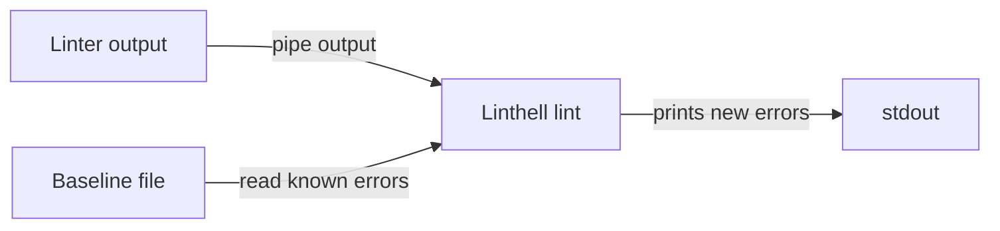

# Linthell
Meta linter to adapt new linter into existing codebase.

The purpose of this tool is to be able to introduce new linter into existing codebase without need to fix all existing code right now but in process.

## Features
- filter known errors out of any linter output
- [pre-commit support](#pre-commit-support)
- [config file support](#config-file)
- [plugins system for easy usage](#plugins)
- [parse using regex to adapt new linters](#regex)

## Usage
### Quickstart
```bash
pip install linthell flake8

# Generate baseline file of all existing errors in project
flake8 . | linthell baseline --baseline flake8-baseline.txt --plugin-name flake8
# Filter flake8 output to remove existing errors
# No new errors!
flake8 . | linthell lint --baseline flake8-baseline.txt --plugin-name flake8

# Introduce new error
echo "import sys" > file.py
# New error found!
flake8 . | linthell lint --baseline flake8-baseline.txt --plugin-name flake8

# To get info about specific command or group of commands, use `<command> --help`
linthell --help
```

### `pre-commit` support
Linthell has `pre-commit` support if `pre-commit` package is installed in the same environment as `linthell`. 
```yaml
repos:
  - repo: local
    hooks:
      - id: linthell flake8
        name: linthell flake8
        language: system
        entry: linthell pre-commit lint --baseline flake8-baseline.txt --plugin-name flake8 --linter-command "flake8 --config ..."
        types:  [python]
```

```bash
# Generate baseline of all files handled by pre-commit hook
linthell pre-commit baseline --baseline flake8-baseline.txt --plugin-name flake8 --linter-command "flake8 --config ..." --hook-name "linthell flake8" 

# Run pre-commit agains all files handled by this hook
pre-commit run --all "linthell black"
```

### Config file
`linthell` can inject params from config file (`linthell --config path/to/config.ini`). `common` section applies for all commands, command specific config are specified by their name section, for example `[lint]`. Nested commands are specified via dot. For example `linthell pre-commit lint` reads config from `[pre-commit.lint]` section.

Keys must have same name as argument name of their command function. For example, `baseline_file` and `lint_format`.


## How it works
Linthell works with linter's output (stdout or stderr, depends on where linter prints it's errors). The first stage is to generate baseline file - list of all known errors in codebase.


The second stage is to lint. Linter output pipes to `linthell lint`, and the command parses linter output and compares found errors with known from generated baseline file. If it founds new errors, linthell outputs them and returns non-zero exit code. If all found errors are known, linthell filter them all and exit with status code 0.


## Adapt new linter
Linthell has 2 way to parse linter's output:
- easy way - using plugins
- hard way - using regex

### Plugins
Plugins provide the easy way to connect linthell with linter. You just use `--plugin-name` argument like this:
```bash
flake8 . | linthell baseline --plugin-name flake8
black --check . | linthell lint --plugin-name black-check
```

#### Write your own plugin
linthell provides the API for your own plugin. To make a new plugin you should:
- Create subclass of `linthell.plugins.base.LinthellPlugin` class inside your python project and provide implementation for it's abstract methods.
- Register your subclass as plugin. To do it you need to register your subclass as `entry point` with group name `linthell.plugins`, name equals to your plugin name and value equals to full path to use subclass. The way to register `entry point` can depends on package manager you use ([pip](https://setuptools.pypa.io/en/latest/userguide/entry_point.html#entry-points-for-plugins), [poetry](https://python-poetry.org/docs/pyproject/#plugins))

Example implementation of plugins can be found in linthell source code, linthell provides couple plugins for some python linters.


### Regex
Regex is the first way to connect linthell with linter. It's powerfull enough to use it almost any linter (as long as linter's output can be parsed regex) and can work with unknown linters or custom linter output formats. The downside of regex is they're hard to write.

#### How to use regex
Linthell uses `--lint-format` option to define regex for parsing. Suitable regex must contains 3 named [python-like](https://docs.python.org/3/howto/regex.html#:~:text=The%20syntax%20for%20a%20named%20group%20is%20one%20of%20the%20Python%2Dspecific%20extensions%3A%20(%3FP%3Cname%3E...).%20name%20is%2C%20obviously%2C%20the%20name%20of%20the%20group) capturing groups: 
- `path` - relative file path 
- `line` - line number
- `message` - linter message

Linter error is identified by relative path to file, source code line and message.

Your regex should matches all message related to an issue because unfiltered issues are printed by the whole match.

You can test your regex against linter output with [regex101](https://regex101.com/r/QkLsit/1) (use Python flavor).